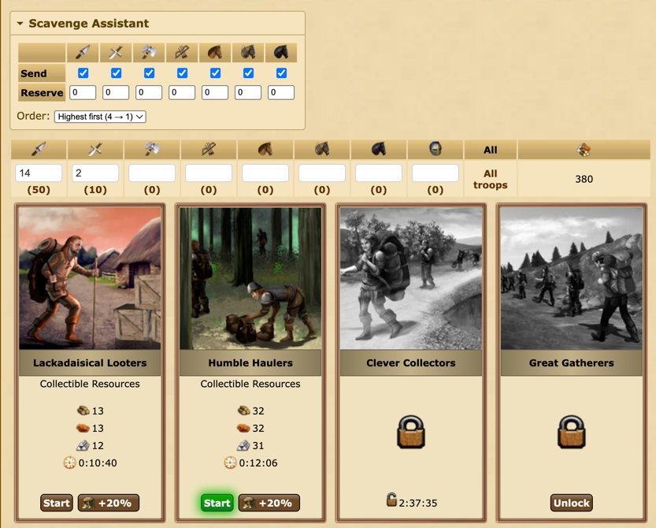

# tribalwars-scavenge-assistant
Scavenging Assistant that works in both the browser and the app. It automatically splits your troops across the available scavenging levels so they finish at the same time and fills in the form - you just click "Start".

## Features
- **Even split** - divides troops by loot factor so all running levels finish together.
- **One level per run** - fills the first free level; click Start and run again for the next.
- **Fill order** - choose lowest level first (1 → 4) or highest first (4 → 1).
- **Active-level highlight** - pulses the Start button of the level just filled and scrolls it into view (handy on mobile).
- **Per-unit settings** - set a reserve per unit type and toggle whether each unit is sent at all. Saved in localStorage.
- **Auto language detection** - UI follows the game language (18 languages, falls back to English).

