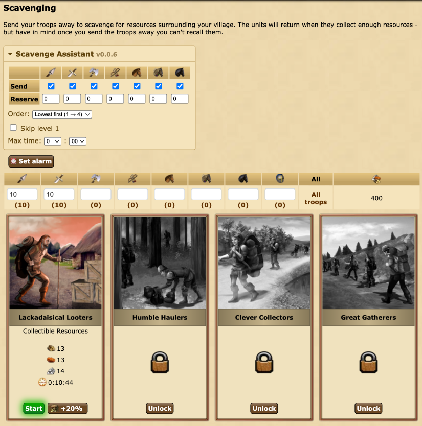

# tribalwars-scavenge-assistant
Scavenging Assistant that works in both the browser and the app. It automatically splits your troops across the available scavenging levels so they finish at the same time and fills in the form - you just click "Start".

## Features
- **Even split** - divides troops by loot factor so all running levels finish together.
- **Auto-advance** - fills the first free level; clicking Start sends the squad, then automatically fills and scrolls to the next free level.
- **Fill order** - choose lowest level first (1 → 4) or highest first (4 → 1).
- **Skip level 1** - optionally leave the weakest level out of the split.
- **Active-level highlight** - pulses the Start button of the level just filled and scrolls it into view (handy on mobile).
- **Per-unit settings** - set a reserve per unit type and toggle whether each unit is sent at all. Saved in localStorage.
- **Max run time** - optionally cap how long a scavenge run may take; squads are scaled down to fit (0:00 = off).
- **Set alarm** - one tap schedules a wake-up for when the last running squad returns: Android opens the Clock app pre-filled, iOS shows a calendar event to add ("Add All"), desktop downloads an .ics file.
- **Auto language detection** - UI follows the game language (18 languages, fully translated, falls back to English).

